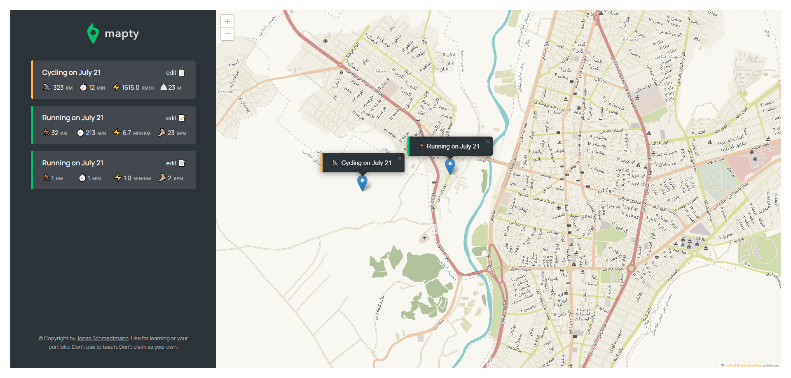

# Mapty

Mapty is a web application that allows users to track their workouts by marking their exercise locations on a map and adding details about each workout. This project was coded along with Jonas Schmedtmann's JavaScript course on Udemy.

## Features

- **Interactive Map:** View and interact with a world map.
- **Workout Logging:** Add workout details such as type (running or cycling), distance, duration, and more.
- **Local Storage:** All workout data is stored locally in the browser, so it persists even after refreshing the page.

## How It Works

1. **Adding Workouts:** Click on the map to add a workout at a specific location.
2. **Entering Details:** A form will appear where you can enter details about your workout, such as whether it was running or cycling, the distance, duration, and any additional notes.
3. **Viewing Workouts:** All added workouts are displayed on the map with markers and listed below the map for easy access.

## Technologies Used

- HTML
- CSS
- JavaScript
- Leaflet (for map functionality)
- LocalStorage API

## Installation

1. Clone the repository:

   ```
   git clone https://github.com/ahmadmohammadirad2006/mapty.git
   ```

3. Open `index.html` in your browser to view the application.

## Screenshot



## Acknowledgements

This project was created as part of [Jonas Schmedtmann's JavaScript course](https://www.udemy.com/course/the-complete-javascript-course/) on Udemy. Special thanks to Jonas for his excellent teaching and resources.

## Contributing

If you have any suggestions or improvements, feel free to create a pull request or open an issue.
